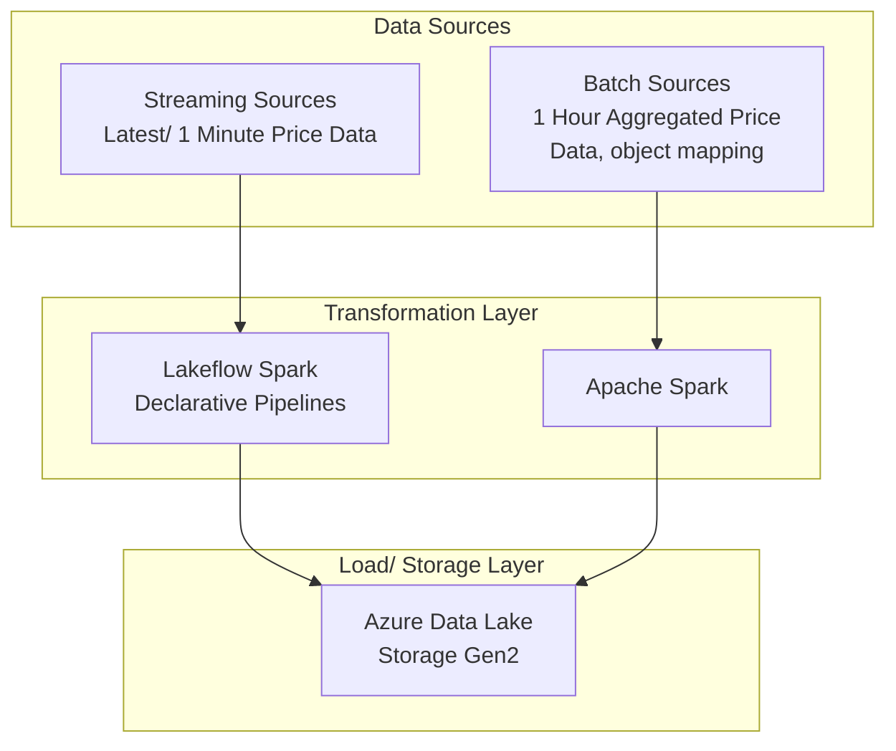
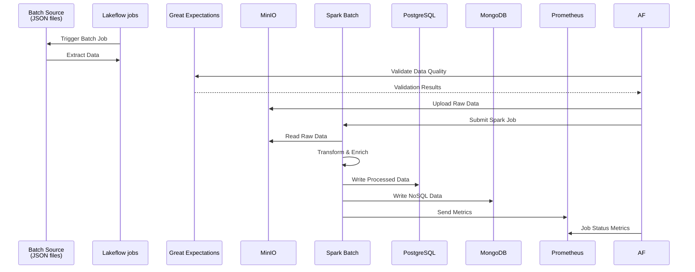
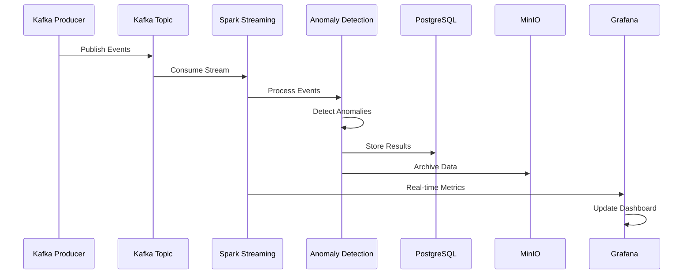

# RuneScape Price Data Ingestion Tool

# Table of Contents

1. [Overview](#overview)
2. [Architecture](#architecture)

# Overview 

The **RuneScape Price Data Ingestion Tool** is desgined to collect, transform, and store data from the [OSRS RuneScape WIKI price API](https://oldschool.runescape.wiki/w/RuneScape:Real-time_Prices) for Old School RuneScape following a medallion architecture.

## Architecture
The architecture of the end-to-end data pipeline is designed to handle both batch and streaming data processing. Below is a high-level overview of the components and their interactions:

### High-Level Architecture

### Data Flow Diagram

  

### Batch Pipeline Flow

### Streaming Pipeline Flow

Disclaimer: This site is not affilated with RuneScape, Old School Runescape, Jagex Ltd, or the OSRS Wiki.
