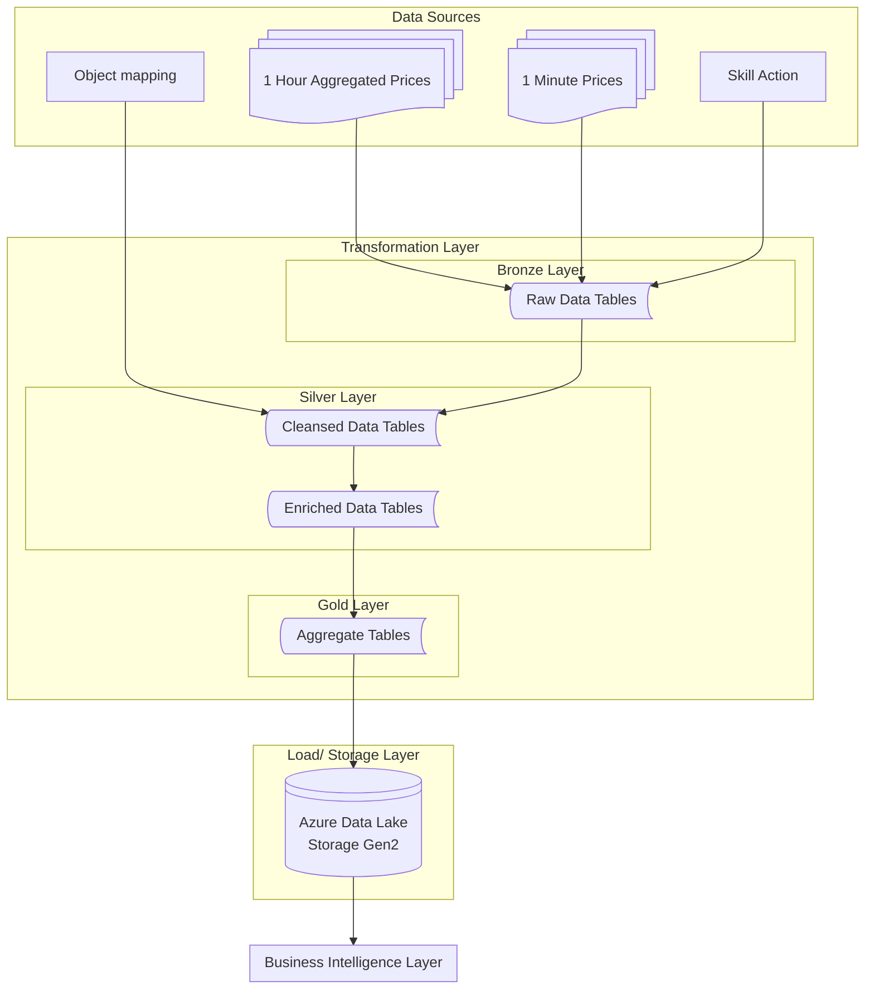
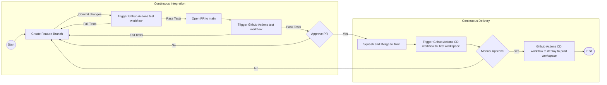

# RuneScape Price Data Ingestion Tool

# Table of Contents

1. [Overview](#overview)
2. [Architecture](#architecture)
3. [Data Flow Diagram](#data-flow-diagram)
4. [Requirements](#requirements)
5. [Install](#install)
6. [Contributing](#contributing)

# Overview 

The **RuneScape Price Data Ingestion Tool** is designed to collect, transform, and store data from the [OSRS RuneScape WIKI price API](https://oldschool.runescape.wiki/w/RuneScape:Real-time_Prices) for Old School RuneScape following a medallion architecture.

## Architecture

The architecture of the end-to-end data pipeline is designed to handle both batch and streaming data processing. Below is a high-level overview of the components and their interactions:

### High-Level Architecture

### Data Flow Diagram

TODO add archival jobs to data flow.  

  

### CI/CD Workflow

This project uses Github actions to automate testing (on commit/ push) and for deployment to prod as described below.

This repo uses github actions to ...  
Databricks OAuth token federation, also known as OpenID Connect (OIDC)  

[link](https://learn.microsoft.com/en-us/azure/databricks/dev-tools/auth/provider-github)

### Requirements

Runs on Serverless environment version 5 [Link](https://docs.databricks.com/aws/en/release-notes/serverless/environment-version/five)  
Operating System: Ubuntu 24.04.3 LTS  
Python: 3.12.3  
Databricks Connect: 18 (Databricks Connect is continuously updated in the latest serverless environment version. Run pip list to confirm the exact version in your current environment.)  
Scala: 2.13.16  
JDK: 17  
Databricks CLI [Link](https://learn.microsoft.com/en-us/azure/databricks/dev-tools/cli/install)

### Azure Setup

#### Storage Account

Enable File Events when setting up the external storage in the Databricks Catalog Explorer.

### Databricks Setup

#### Catalog creation  

You need to create one catalog for dev, test, and prod each.  
You can run the one_off/initial_load/catalog_creation.ipynb file, but first update the Managed Locations with your locations.

- runescape_dev  
  - 00_landing
  - 01_bronze
  - 02_silver
  - 03_gold
- runescape_test  
  - 00_landing
  - 01_bronze
  - 02_silver
  - 03_gold
- runescape  
  - 00_landing
  - 01_bronze
  - 02_silver
  - 03_gold

#### Initial Data Load  

TODO this section should be automated...  
Once the catalogs, schemas, and volumes are created, you need to create the directory skill_actions under ../00_landing/data_sources/ for each catalog  
You then need to copy the json files from data_files/skill_actions to these directoties.  
You then need to run resources/initial_load.yml job to create tables/ load the item mapping data.  

### Install

TODO  
setuptools. wheel  
databricks.yml file  
Local testing and CICD workflow will use the Pyspark venv .venv_pyspark
Uses requirements-pyspark.txt  
Testing on databricks will use databricks connect venv .venv  
Uses requirements-dbc.txt  

Testing setup using remote databricks cluster
requirements.txt  
pytest install
Within the python virtual env, you need to run the command below to auth with databricks
databricks auth login --host "host-url"  

rs_project wheel install  

Create service principal and OAuth secret  
secret is used in .databrickscfg for .venv Auth  
Need to create separate secrets , 1 for dev, test, and prod  
[link](https://learn.microsoft.com/en-us/azure/databricks/dev-tools/auth/oauth-m2m#-step-1-create-an-oauth-secret)  
[link](https://learn.microsoft.com/en-us/azure/databricks/dev-tools/cli/authentication#m2m-auth)

https://accounts.azuredatabricks.net

[DEFAULT]  
host          = account-console-url  
client_id     = service-principal-client-id  
client_secret = service-principal-oauth-secret  

[rsdev]    
host      = workspace-url
auth_type = databricks-cli  

[rstest]  
host      = workspace-url  
auth_type = databricks-cli  

[rsprod]  
host      = workspace-url  
auth_type = databricks-cli  

databricks.yml

### Contributing

TODO

Disclaimer: This site is not affilated with RuneScape, Old School Runescape, Jagex Ltd, or the OSRS Wiki.
