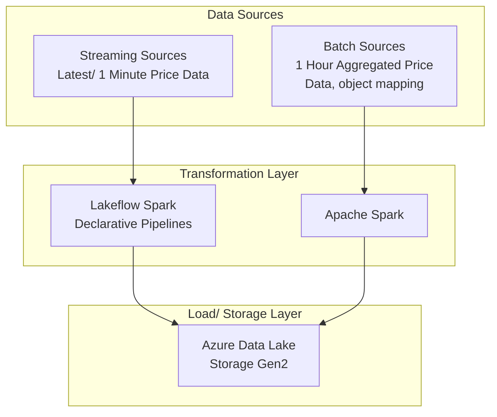
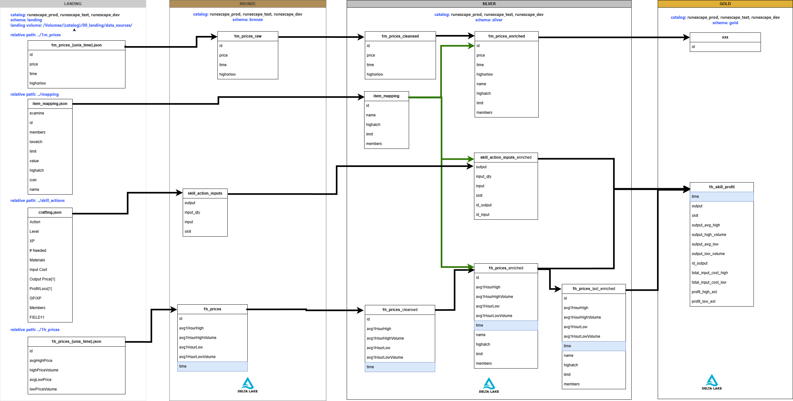

# RuneScape Price Data Ingestion Tool

# Table of Contents

1. [Overview](#overview)
2. [Architecture](#architecture)
3. [Data Flow Diagram](#data-flow-diagram)
4. [Requirements](#requirements)
5. [Install](#install)
6. [Contributing](#contributing)

# Overview 

The **RuneScape Price Data Ingestion Tool** is designed to collect, transform, and store data from the [OSRS RuneScape WIKI price API](https://oldschool.runescape.wiki/w/RuneScape:Real-time_Prices) for Old School RuneScape following a medallion architecture.

## Architecture
The architecture of the end-to-end data pipeline is designed to handle both batch and streaming data processing. Below is a high-level overview of the components and their interactions:

### High-Level Architecture

### Data Flow Diagram

  

### Requirements
Runs on Databricks Runtime 17.3 LTS. powered by Apache Spark 4.0.0  
Datbricks Connect  
Python 3.12.10+  
Java 21 SDK  
Databricks CLI [Link](https://learn.microsoft.com/en-us/azure/databricks/dev-tools/cli/install)

### Databricks Setup
Catalog creaetion  
1 for dev, test, and prod each.
TODO add details

### Install
TODO  
setuptools. wheel  
databricks.yml file  
Pyspark venv .venv_pyspark
Uses requirements-pyspark.txt

Testing setup using remote databricks cluster
requirements.txt  
pytest install
Within the python virtual env, you need to run the command below to auth with databricks
databricks auth login --host "host-url"

Create service principal and OAuth secret  
secret is used in .databrickscfg for .venv Auth  
Need to create separate secrets , 1 for dev, test, and prod  
https://learn.microsoft.com/en-us/azure/databricks/dev-tools/auth/oauth-m2m#-step-1-create-an-oauth-secret  
https://learn.microsoft.com/en-us/azure/databricks/dev-tools/cli/authentication#m2m-auth

https://accounts.azuredatabricks.net

[DEFAULT]  
host          = account-console-url  
client_id     = service-principal-client-id  
client_secret = service-principal-oauth-secret  

[rsdev]    
host      = workspace-url
auth_type = databricks-cli  

[rstest]  
host      = workspace-url  
auth_type = databricks-cli  

[rsprod]  
host      = workspace-url  
auth_type = databricks-cli  

### Contributing
TODO

Disclaimer: This site is not affilated with RuneScape, Old School Runescape, Jagex Ltd, or the OSRS Wiki.
